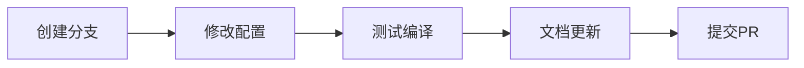

# SDU Thesis 开发者指南

欢迎来到 SDU Thesis LaTeX 模板的开发者文档！本指南将帮助您了解项目结构、配置系统，并指导您如何贡献代码。

## 📋 目录

- [快速开始](#快速开始)
- [项目结构](#项目结构)
- [配置系统](#配置系统)
- [开发工作流](#开发工作流)
- [贡献指南](#贡献指南)
- [相关文档](#相关文档)

## 🚀 快速开始

### 环境要求

- **LaTeX 发行版**: TeXLive 2020+ 或 MiKTeX
- **编译器**: XeLaTeX
- **参考文献**: Biber
- **操作系统**: Windows/macOS/Linux

### 开发环境设置

1. **克隆项目**
   ```bash
   git clone https://github.com/h1s97x/sduthesis.git
   cd sduthesis
   ```

2. **安装依赖**
   ```bash
   # 确保安装了必要的 LaTeX 宏包
   tlmgr install ctex biblatex-gb7714-2015 algorithm2e
   ```

3. **编译测试**
   ```bash
   xelatex main.tex
   biber main
   xelatex main.tex
   xelatex main.tex
   ```

## 📁 项目结构

```
sduthesis/
├── assets/                    # 资源文件
│   ├── images/               # 图片资源（按功能分类）
│   ├── fonts/                # 字体文件
│   ├── docs/                 # 文档资源
│   └── data/                 # 数据文件
├── src/                      # 源文件
│   ├── chapters/             # 章节内容
│   └── frontmatter/          # 前置内容
├── config/                   # 配置文件
│   ├── main/                 # 主配置
│   └── others/               # 其他配置
├── docs/                     # 开发者文档
│   ├── developer/            # 开发者指南
│   ├── examples/             # 示例代码
│   └── templates/            # 模板文件
├── update/                   # 更新钩子
├── main.tex                  # 主文档
├── sduthesis.cls             # 文档类
└── README.md                 # 用户说明
```

### 核心文件说明

| 文件/目录 | 作用 | 修改频率 |
|-----------|------|----------|
| `sduthesis.cls` | 文档类定义 | 低 |
| `main.tex` | 主文档入口 | 低 |
| `config/` | 配置文件目录 | 中 |
| `src/` | 内容源文件 | 高 |
| `assets/` | 资源文件 | 中 |

## ⚙️ 配置系统

### 当前配置结构

```
config/
├── main/
│   └── config-main.tex       # 主配置文件（宏包、样式、格式）
└── others/
    ├── config-abstract.tex   # 摘要配置
    ├── config-bibliography.tex # 参考文献配置
    ├── config-coverpage.tex  # 封面配置
    ├── config-contents.tex   # 目录配置
    ├── config-acknowledgement.tex # 致谢配置
    └── config-appendix.tex   # 附录配置
```

### 配置文件职责

#### config-main.tex
- **宏包导入**: 所有必需的 LaTeX 宏包
- **字体设置**: 中英文字体配置
- **页面布局**: 页边距、行距等
- **样式定义**: 章节标题、图表标题等
- **数学设置**: 数学符号和环境
- **代码样式**: listings 配置

#### 其他配置文件
- **模块化设计**: 每个文件负责特定功能
- **环境定义**: 自定义 LaTeX 环境
- **命令定义**: 自定义 LaTeX 命令
- **样式配置**: 特定模块的样式设置

### 配置修改指南

1. **字体修改**
   ```latex
   % 在 config-main.tex 中修改
   \newCJKfontfamily\songti[
       Path=assets/fonts/,
       AutoFakeBold=3,
       AutoFakeSlant=0.25
   ]{YourFont.ttf}
   ```

2. **页面布局调整**
   ```latex
   % 修改页边距
   \geometry{
       a4paper,
       left=3cm,    % 左边距
       right=3cm,   # 右边距
       top=2.5cm,   # 上边距
       bottom=2.5cm # 下边距
   }
   ```

3. **章节样式自定义**
   ```latex
   % 修改章节标题格式
   \ctexset{
       chapter={
         format=\centering\zihao{3}\allbfhei,
         name={第,章},
         beforeskip=21.6pt,
         afterskip=18pt,
       }
   }
   ```

## 🔄 开发工作流

### 1. 功能开发流程



### 2. 测试流程

1. **基础编译测试**
   ```bash
   xelatex main.tex
   ```

2. **完整编译测试**
   ```bash
   xelatex main.tex
   biber main
   xelatex main.tex
   xelatex main.tex
   ```

3. **功能测试**
   - 检查所有图片是否正常显示
   - 验证参考文献是否正确
   - 测试交叉引用功能
   - 检查目录生成

### 3. 代码规范

#### LaTeX 代码规范
- **缩进**: 使用 4 个空格
- **注释**: 重要配置项必须添加注释
- **命名**: 使用有意义的命令和环境名称
- **模块化**: 相关功能放在同一配置文件中

#### 文件命名规范
- **配置文件**: `config-功能名.tex`
- **源文件**: 使用下划线分隔，小写字母
- **图片文件**: 按功能分类，语义化命名

## 🤝 贡献指南

### 贡献类型

1. **Bug 修复**
   - 修复编译错误
   - 修复样式问题
   - 修复兼容性问题

2. **功能增强**
   - 添加新的配置选项
   - 改进现有功能
   - 性能优化

3. **文档改进**
   - 完善开发者文档
   - 添加使用示例
   - 翻译文档

### 提交规范

#### Commit Message 格式
```
<type>(<scope>): <description>

[optional body]

[optional footer]
```

#### Type 类型
- `feat`: 新功能
- `fix`: Bug 修复
- `docs`: 文档更新
- `style`: 代码格式调整
- `refactor`: 代码重构
- `test`: 测试相关
- `chore`: 构建过程或辅助工具的变动

#### 示例
```
feat(config): add custom font configuration support

- Add font path configuration option
- Support for custom Chinese fonts
- Update documentation with font setup guide

Closes #123
```

### Pull Request 流程

1. **Fork 项目**
2. **创建功能分支**
   ```bash
   git checkout -b feature/your-feature-name
   ```
3. **开发和测试**
4. **提交更改**
5. **创建 Pull Request**
6. **代码审查**
7. **合并到主分支**

## 📚 相关文档

### 开发者文档
- [配置详细说明](configuration-guide.md)
- [自定义指南](customization-guide.md)
- [常见问题解决](troubleshooting.md)
- [API 参考](api-reference.md)

### 示例和模板
- [自定义字体示例](../examples/custom-fonts/)
- [自定义样式示例](../examples/custom-styles/)
- [配置模板](../templates/config-template.tex)

### 外部资源
- [LaTeX 官方文档](https://www.latex-project.org/help/documentation/)
- [CTeX 宏包文档](https://ctan.org/pkg/ctex)
- [XeLaTeX 使用指南](https://www.overleaf.com/learn/latex/XeLaTeX)

## 🆘 获取帮助

### 联系方式
- **项目主页**: [GitHub - sduthesis](https://github.com/h1s97x/sduthesis)
- **作者邮箱**: zhukangwang1005@gmail.com
- **Issue 跟踪**: [GitHub Issues](https://github.com/h1s97x/sduthesis/issues)

### 社区资源
- **LaTeX 中文社区**: [LaTeX 工作室](https://www.latexstudio.net/)
- **TeX Stack Exchange**: [tex.stackexchange.com](https://tex.stackexchange.com/)

---

**最后更新**: 2024年12月30日  
**文档版本**: v1.0  
**维护者**: SDU Thesis 开发团队